# SalesPrevision — Documentação Técnica

## Índice

1. [Visão Geral da Arquitectura](#1-visão-geral-da-arquitectura)
2. [Estrutura de Módulos](#2-estrutura-de-módulos)
3. [Entidades e Modelo de Dados](#3-entidades-e-modelo-de-dados)
4. [Diagrama de Entidade-Relacionamento (ERD)](#4-diagrama-de-entidade-relacionamento-erd)
5. [Endpoints REST](#5-endpoints-rest)
6. [Comunicação Inter-Serviços](#6-comunicação-inter-serviços)
7. [Flows de Execução](#7-flows-de-execução)
8. [Spring Batch — Arquitectura de Jobs](#8-spring-batch--arquitectura-de-jobs)
9. [Motores de Processamento](#9-motores-de-processamento)
10. [Enumerações](#10-enumerações)
11. [Tratamento de Erros](#11-tratamento-de-erros)
12. [Diagramas UML](#12-diagramas-uml)

---

## 1. Visão Geral da Arquitectura

O SalesPrevision é um sistema de previsão de vendas baseado em microserviços. Ingere ficheiros de dados tabulares, valida-os contra templates configuráveis, aplica pipelines de selecção e transformação, e envia o resultado para uma API de previsão externa num agendamento configurável.

### Componentes Principais

```
┌─────────────────────────────────────────────────────────────────┐
│                         CLIENT / FRONTEND                        │
└────────────────────────────┬────────────────────────────────────┘
                             │ HTTP REST
          ┌──────────────────┼──────────────────────┐
          │                  │                       │
          ▼                  ▼                       ▼
┌──────────────────┐ ┌──────────────────┐ ┌──────────────────────┐
│ template-service │ │ingestion-service │ │  pipeline-service    │
│    (port 8081)   │ │   (port 8082)    │ │    (port 8083)       │
│                  │ │                  │ │                      │
│ Define templates │ │ Upload ficheiros │ │ Define pipelines de  │
│ (colunas, tipos, │ │ Valida e armazena│ │ extracção, filtros e │
│  regras)         │ │ registos         │ │ transformações       │
└────────┬─────────┘ └────────┬─────────┘ └──────────┬───────────┘
         │  ◄──────── REST ───┘           ◄── REST ──┘
         │
         │  (core — biblioteca partilhada)
         │
         ▼
┌──────────────────────────────────────────────────────────────────┐
│                       batch-service (port 8084)                  │
│                                                                  │
│  Spring Batch Jobs — lê dados do ingestion-service, aplica       │
│  pipelines do pipeline-service, envia para API de previsão       │
└──────────────────────────────────────────────────────────────────┘
                             │
                             │ HTTP POST (chunks de 100 registos)
                             ▼
                  ┌──────────────────────┐
                  │  External Prediction │
                  │        API           │
                  └──────────────────────┘
```

### Tecnologias

| Tecnologia | Versão | Utilização |
|---|---|---|
| Java | 17 | Linguagem |
| Spring Boot | 4.0 | Framework principal |
| Spring Batch | — | Orquestração de jobs |
| Spring Data JPA | — | Persistência |
| MapStruct | — | Mapeamento de entidades |
| H2 Database | — | BD em memória (desenvolvimento) |
| PostgreSQL | — | BD para produção (driver incluído) |
| Jackson | — | Serialização JSON |
| Lombok | — | Redução de boilerplate |
| Maven | — | Build e gestão de dependências |

---

## 2. Estrutura de Módulos

```
salesPrevision/
├── core/                          ← biblioteca partilhada (DTOs, enums, excepções)
├── template-service/              ← porta 8081
├── ingestion-service/             ← porta 8082
├── pipeline-service/              ← porta 8083
├── batch-service/                 ← porta 8084
└── pom.xml                        ← parent POM
```

### Estrutura de Pacotes por Módulo

#### core
```
com.uab.core
├── dto/
│   ├── ingestion/       TemplateDto, IngestionJobResponse, IngestedRecordResponse,
│   │                    IngestionErrorResponse, CreateIngestionJobResponse
│   ├── pipeline/        PipelineDto
│   └── template/        CreateIngestionTemplateRequest, IngestionTemplateResponse,
│                        TemplateFieldRequest/Response, TemplateValidationRuleRequest/Response
├── enums/               BatchExecutionStatus, FieldDataType, FileType, FilterOperator,
│                        IngestionStatus, LogicalOperator, TemplateRuleType,
│                        TransformationType, ValidationStatus
└── exception/           BadRequestException, ResourceNotFoundException, GlobalExceptionHandler
```

#### template-service
```
com.uab.salesprevision.template
├── config/              I18nConfig
├── controller/          IngestionTemplateController
├── entity/              IngestionTemplate, TemplateField, TemplateValidationRule
├── mappers/             TemplateEntitiesMapper (MapStruct)
├── repository/          IngestionTemplateRepository, TemplateFieldRepository,
│                        TemplateValidationRuleRepository
└── service/             IngestionTemplateService
```

#### ingestion-service
```
com.uab.salesprevision.ingestion
├── client/              TemplateClient
├── config/              JacksonConfig
├── controller/          IngestionController
├── entity/              IngestionJob, IngestedRecord, IngestionError
├── mappers/             IngestionEntitiesMapper (MapStruct)
├── repository/          IngestionJobRepository, IngestedRecordRepository,
│                        IngestionErrorRepository
└── service/
    ├── IngestionService
    ├── IngestionRecordFactory
    └── ingestion/       IngestionProcessor (interface), AbstractIngestionProcessor,
                         CsvIngestionProcessor, IngestionProcessorFactory
```

#### pipeline-service
```
com.uab.salesprevision.pipeline
├── client/              TemplateClient
├── config/              JacksonConfig
├── controller/          PipelineController
├── dto/                 CreateForecastPipelineRequest, ForecastPipelineResponse
├── entity/              ForecastPipeline, PipelineField, PipelineFilter
├── mapper/              PipelineMapper (MapStruct)
├── repository/          ForecastPipelineRepository
└── service/             PipelineService
```

#### batch-service
```
com.uab.salesprevision.batch
├── batch/               ForecastJobConfig, ForecastItemReader,
│                        ForecastItemProcessor, ForecastItemWriter
├── client/              IngestionClient, PipelineClient
├── config/              JacksonConfig
├── controller/          BatchController
├── dto/                 CreateBatchScheduleRequest, BatchScheduleResponse,
│                        BatchExecutionResponse
├── engine/              FilterEngine, TransformationEngine
├── entity/              BatchScheduleConfig, BatchExecution
├── repository/          BatchScheduleConfigRepository, BatchExecutionRepository
├── scheduler/           BatchScheduler
└── service/             BatchScheduleService
```

---

## 3. Entidades e Modelo de Dados

### 3.1 template-service

#### IngestionTemplate
| Campo | Tipo | Restrições | Notas |
|---|---|---|---|
| `id` | Long | PK, auto-gerado | |
| `name` | String(150) | único, obrigatório | |
| `description` | String(1000) | | |
| `fileType` | FileType | enum | CSV, JSON, XLSX, TXT, UNKNOWN |
| `delimiter` | String(10) | | Apenas CSV |
| `hasHeader` | Boolean | default `true` | |
| `sheetName` | String(150) | | Apenas XLSX |
| `rootPath` | String(255) | | Caminho raiz para JSON |
| `version` | Integer | default `1` | |
| `active` | Boolean | default `true` | |
| `createdAt` | LocalDateTime | auto | |
| `updatedAt` | LocalDateTime | auto | |

#### TemplateField
| Campo | Tipo | Restrições | Notas |
|---|---|---|---|
| `id` | Long | PK | |
| `template` | ManyToOne | cascade all | |
| `fieldName` | String(120) | obrigatório | Nome canónico no sistema |
| `sourceName` | String(120) | | Nome da coluna no ficheiro de origem |
| `dataType` | FieldDataType | enum | STRING, INTEGER, LONG, DECIMAL, BOOLEAN, DATE, DATETIME |
| `required` | Boolean | | |
| `positionIndex` | Integer | | Índice de posição (ficheiros sem cabeçalho) |
| `dateFormat` | String(50) | | Formato de data |
| `defaultValue` | String(255) | | |
| `validationRegex` | String(500) | | |
| `targetPath` | String(255) | | |
| `active` | Boolean | | |

#### TemplateValidationRule
| Campo | Tipo | Restrições | Notas |
|---|---|---|---|
| `id` | Long | PK | |
| `field` | ManyToOne | cascade all | |
| `ruleType` | TemplateRuleType | enum | NOT_NULL, REGEX, MIN, MAX, ENUM, DATE_FORMAT |
| `ruleValue` | String(500) | | Valor de regra (padrão regex, valor min, lista ENUM) |
| `message` | String(500) | | Mensagem customizada (fallback para mensagem em Português) |
| `active` | Boolean | | |

---

### 3.2 ingestion-service

#### IngestionJob
| Campo | Tipo | Restrições | Notas |
|---|---|---|---|
| `id` | Long | PK | |
| `templateId` | Long | | Referência ao template-service (não JPA) |
| `templateName` | String(150) | | Desnormalizado |
| `status` | IngestionStatus | enum | RECEIVED → PROCESSING → COMPLETED / FAILED |
| `originalFileName` | String(255) | | |
| `storedFileName` | String(255) | | `{UUID}_{nome_sanitizado}` |
| `contentType` | String(100) | | |
| `fileSize` | Long | | Bytes |
| `storagePath` | String(500) | | Caminho absoluto em `uploads/template_{id}/` |
| `checksum` | String(128) | | SHA-256 hex |
| `startedAt` | LocalDateTime | | |
| `finishedAt` | LocalDateTime | | |
| `createdAt` | LocalDateTime | auto | |
| `createdBy` | String(100) | | |
| `errorMessage` | String(4000) | | Definido quando status = FAILED |
| `recordCount` | Long | | |
| `errorCount` | Long | | |

#### IngestedRecord
| Campo | Tipo | Restrições | Notas |
|---|---|---|---|
| `id` | Long | PK | |
| `ingestionJob` | ManyToOne | | |
| `recordIndex` | Long | | Número de linha (1-based) |
| `rawPayload` | TEXT (LOB) | | JSON com valores originais |
| `normalizedPayload` | TEXT (LOB) | | JSON com valores após conversão de tipos |
| `validationStatus` | ValidationStatus | enum | VALID, INVALID, WARNING |
| `createdAt` | LocalDateTime | auto | |

#### IngestionError
| Campo | Tipo | Restrições | Notas |
|---|---|---|---|
| `id` | Long | PK | |
| `ingestionJob` | ManyToOne | | |
| `record` | ManyToOne | opcional | |
| `fieldName` | String(100) | | |
| `errorType` | String(100) | | VALIDATION, REGEX, TYPE_CONVERSION, NOT_NULL, MIN, MAX, ENUM, DATE_FORMAT |
| `message` | String(4000) | | Mensagem em Português |
| `rawValue` | String(1000) | | Valor original do ficheiro |
| `lineNumber` | Long | | |
| `createdAt` | LocalDateTime | auto | |

---

### 3.3 pipeline-service

#### ForecastPipeline
| Campo | Tipo | Restrições | Notas |
|---|---|---|---|
| `id` | Long | PK | |
| `templateId` | Long | | Referência ao template-service |
| `templateName` | String(150) | | Desnormalizado |
| `name` | String(150) | único | |
| `description` | String(1000) | | |
| `active` | Boolean | | |
| `createdAt` | LocalDateTime | auto | |
| `updatedAt` | LocalDateTime | auto | |

#### PipelineField
| Campo | Tipo | Restrições | Notas |
|---|---|---|---|
| `id` | Long | PK | |
| `pipeline` | ManyToOne | cascade all | |
| `sourceFieldName` | String(120) | | Campo em `normalizedPayload` |
| `targetFieldName` | String(120) | | Chave no payload da API de previsão |
| `transformationType` | TransformationType | enum | NONE, RENAME, SCALE, DATE_FORMAT, CAST, REPLACE |
| `transformationConfig` | TEXT | | JSON com parâmetros da transformação |
| `positionIndex` | Integer | | Ordenação do output |
| `active` | Boolean | | |

**Configurações de Transformação (JSON):**
| Tipo | Configuração |
|---|---|
| `SCALE` | `{"factor": "0.01"}` |
| `DATE_FORMAT` | `{"from": "dd/MM/yyyy", "to": "yyyy-MM-dd"}` |
| `REPLACE` | `{"regex": "\\s+", "replacement": "_"}` |
| `NONE` / `RENAME` / `CAST` | Sem configuração necessária |

#### PipelineFilter
| Campo | Tipo | Restrições | Notas |
|---|---|---|---|
| `id` | Long | PK | |
| `pipeline` | ManyToOne | cascade all | |
| `fieldName` | String(120) | | Campo em `normalizedPayload` |
| `operator` | FilterOperator | enum | EQ, NEQ, GT, GTE, LT, LTE, IN, NOT_IN, IS_NULL, IS_NOT_NULL, BETWEEN, CONTAINS |
| `value` | String(500) | | Valor de comparação; IN/NOT_IN usam lista separada por vírgulas; BETWEEN usa "min,max" |
| `logicalOperator` | LogicalOperator | enum | AND / OR — como este filtro combina com o seguinte |
| `orderIndex` | Integer | | Ordem de avaliação |

---

### 3.4 batch-service

#### BatchScheduleConfig
| Campo | Tipo | Restrições | Notas |
|---|---|---|---|
| `id` | Long | PK | |
| `pipelineId` | Long | | Referência ao pipeline-service |
| `pipelineName` | String(150) | | Desnormalizado |
| `cronExpression` | String(150) | | Cron standard Spring de 6 partes |
| `lookbackDays` | Integer | default `7` | Janela temporal de jobs a ler |
| `predictionApiUrl` | String(500) | | URL da API de previsão externa |
| `active` | Boolean | | Schedules inactivos são ignorados |
| `createdBy` | String(100) | | |
| `createdAt` | LocalDateTime | auto | |
| `updatedAt` | LocalDateTime | auto | |

#### BatchExecution
| Campo | Tipo | Restrições | Notas |
|---|---|---|---|
| `id` | Long | PK | |
| `scheduleConfig` | ManyToOne | | |
| `springBatchJobExecutionId` | Long | | Referência cruzada com tabelas do Spring Batch |
| `status` | BatchExecutionStatus | enum | RUNNING, COMPLETED, FAILED, SKIPPED |
| `startedAt` | LocalDateTime | | |
| `finishedAt` | LocalDateTime | | |
| `recordsSent` | Long | | |
| `recordsFailed` | Long | | |
| `errorMessage` | String(4000) | | |
| `createdAt` | LocalDateTime | auto | |

---

## 4. Diagrama de Entidade-Relacionamento (ERD)

### template-service ERD
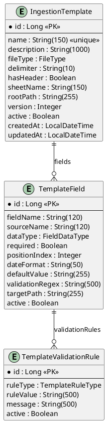

### ingestion-service ERD
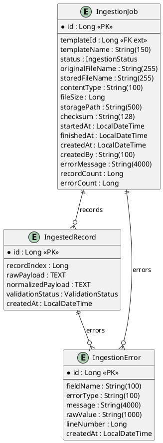

### pipeline-service ERD
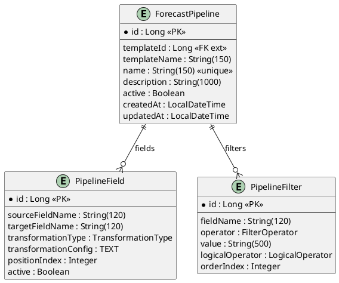

### batch-service ERD
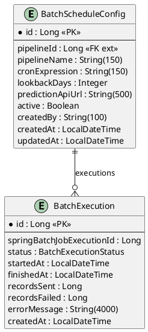

---

## 5. Endpoints REST

### template-service — `http://localhost:8081`

| Método | Endpoint | Request | Response | Descrição |
|---|---|---|---|---|
| POST | `v1/api/templates` | `CreateIngestionTemplateRequest` | `IngestionTemplateResponse` | Criar template com campos e regras |
| GET | `v1/api/templates` | — | `List<IngestionTemplateResponse>` | Listar todos os templates |
| GET | `v1/api/templates/{id}` | — | `IngestionTemplateResponse` | Obter template por ID |

### ingestion-service — `http://localhost:8082`

| Método | Endpoint | Request | Response | Descrição |
|---|---|---|---|---|
| POST | `/api/ingestion/jobs` | `multipart/form-data`: `file`, `templateId`, `createdBy?`, `autoProcess?` | `CreateIngestionJobResponse` | Upload de ficheiro; cria (e opcionalmente processa) job |
| POST | `/api/ingestion/jobs/{jobId}/process` | — | `IngestionJobResponse` | Processa job em estado RECEIVED |
| GET | `/api/ingestion/jobs` | Query: `templateId?`, `status?` | `List<IngestionJobResponse>` | Listar jobs com filtros |
| GET | `/api/ingestion/jobs/{jobId}` | — | `IngestionJobResponse` | Detalhes do job |
| GET | `/api/ingestion/jobs/{jobId}/records` | `Pageable` | `Page<IngestedRecordResponse>` | Registos ingeridos (paginado) |
| GET | `/api/ingestion/jobs/{jobId}/errors` | `Pageable` | `Page<IngestionErrorResponse>` | Erros de validação (paginado) |

### pipeline-service — `http://localhost:8083`

| Método | Endpoint | Request | Response | Descrição |
|---|---|---|---|---|
| POST | `/api/pipelines` | `CreateForecastPipelineRequest` | `ForecastPipelineResponse` | Criar pipeline |
| GET | `/api/pipelines` | Query: `templateId?` | `List<ForecastPipelineResponse>` | Listar pipelines |
| GET | `/api/pipelines/{id}` | — | `ForecastPipelineResponse` | Detalhes da pipeline |
| GET | `/api/pipelines/{id}/dto` | — | `PipelineDto` | DTO consumido pelo batch-service |

### batch-service — `http://localhost:8084`

| Método | Endpoint | Request | Response | Descrição |
|---|---|---|---|---|
| POST | `/api/batch/schedules` | `CreateBatchScheduleRequest` | `BatchScheduleResponse` | Criar agendamento de batch |
| GET | `/api/batch/schedules` | — | `List<BatchScheduleResponse>` | Listar agendamentos |
| GET | `/api/batch/schedules/{id}` | — | `BatchScheduleResponse` | Detalhes do agendamento |
| GET | `/api/batch/schedules/{id}/executions` | `Pageable` | `Page<BatchExecutionResponse>` | Histórico de execuções (paginado) |
| POST | `/api/batch/schedules/{id}/trigger` | — | `BatchExecutionResponse` | Disparar execução manual (202 Accepted) |

---

## 6. Comunicação Inter-Serviços

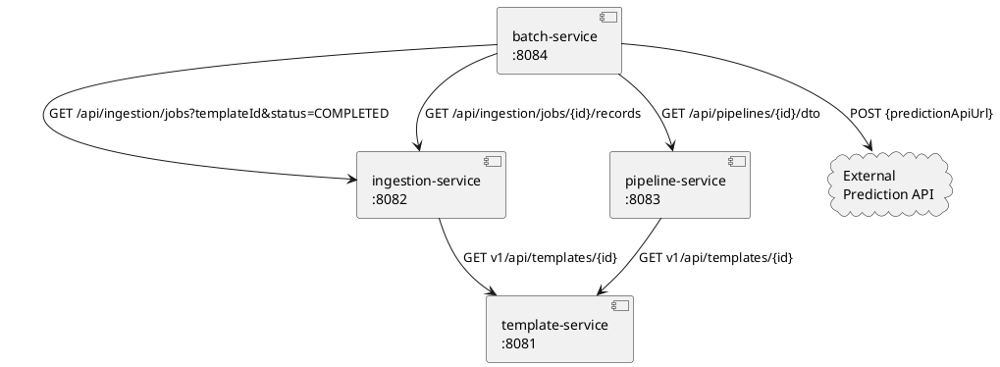

### Clientes REST

Todos os clientes usam `RestClient` (Spring 6.1+) configurado via `application.properties`.

| Serviço | Cliente | Endpoints Consumidos |
|---|---|---|
| ingestion-service | `TemplateClient` | `GET v1/api/templates/{templateId}` |
| pipeline-service | `TemplateClient` | `GET v1/api/templates/{templateId}` |
| batch-service | `PipelineClient` | `GET /api/pipelines/{pipelineId}/dto` |
| batch-service | `IngestionClient` | `GET /api/ingestion/jobs?templateId&status=COMPLETED` |
| batch-service | `IngestionClient` | `GET /api/ingestion/jobs/{jobId}/records?page&size` |

Erros HTTP 4xx resultam em `ResourceNotFoundException` propagada ao chamador.

---

## 7. Flows de Execução

### 7.1 Flow de Ingestão de Ficheiro

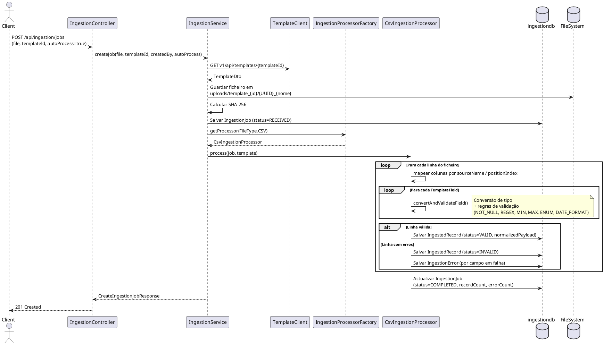

### 7.2 Flow de Configuração de Pipeline

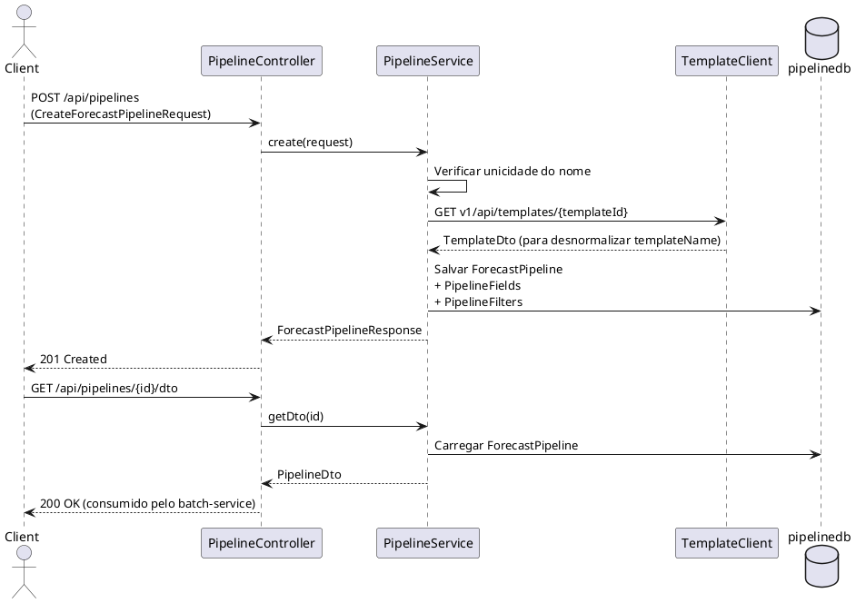

### 7.3 Flow de Execução Batch

```plantuml
@startuml batch-flow
participant "BatchScheduler\n(a cada 60s)" as SCHED
participant "BatchScheduleService" as BSS
participant "JobLauncher\n(Spring Batch)" as JL
participant "ForecastItemReader" as READER
participant "IngestionClient" as IC
participant "ForecastItemProcessor" as PROC
participant "PipelineClient" as PC
participant "ForecastItemWriter" as WRITER
database "batchdb" as DB
cloud "External\nPrediction API" as EXT

SCHED -> SCHED : checkSchedules() — avaliar cron expressions
SCHED -> BSS : runJob(config) [se schedule activo e due]
BSS -> DB : Salvar BatchExecution (status=RUNNING)
BSS -> JL : run(forecastJob, {scheduleConfigId, batchExecutionId, startedAt})

JL -> READER : @BeforeStep — carregar parâmetros do job
READER -> DB : Carregar BatchScheduleConfig
READER -> IC : GET /api/ingestion/jobs?templateId&status=COMPLETED
IC --> READER : Lista de IngestionJobResponse
loop Para cada job dentro da janela lookbackDays
  READER -> IC : GET /api/ingestion/jobs/{id}/records (paginado, 200/página)
  IC --> READER : Página de IngestedRecordResponse
  READER -> READER : Desserializar normalizedPayload → Map<String,Object>
end

loop Para cada chunk de 100 registos
  JL -> PROC : process(record)
  note right: @BeforeStep — carregar PipelineDto uma vez
  PROC -> PC : GET /api/pipelines/{id}/dto (uma vez por step)
  PC --> PROC : PipelineDto
  PROC -> PROC : FilterEngine.apply(filters, record)
  alt Registo filtrado (excluído)
    PROC --> JL : null (Spring Batch ignora)
  else Registo aceite
    PROC -> PROC : TransformationEngine.apply(fields, record)
    PROC --> JL : Map<String,Object> transformado
  end
  JL -> WRITER : write(chunk)
  WRITER -> EXT : POST {predictionApiUrl}\n{pipelineId, pipelineName, scheduleConfigId,\n batchExecutionId, recordCount, records:[...]}
  EXT --> WRITER : Response
  WRITER -> DB : Actualizar recordsSent / recordsFailed
end

JL -> BSS : Job concluído
BSS -> DB : Actualizar BatchExecution (status=COMPLETED/FAILED, finishedAt)
@enduml
```

### 7.4 Flow de Validação de Campos (Ingestão CSV)

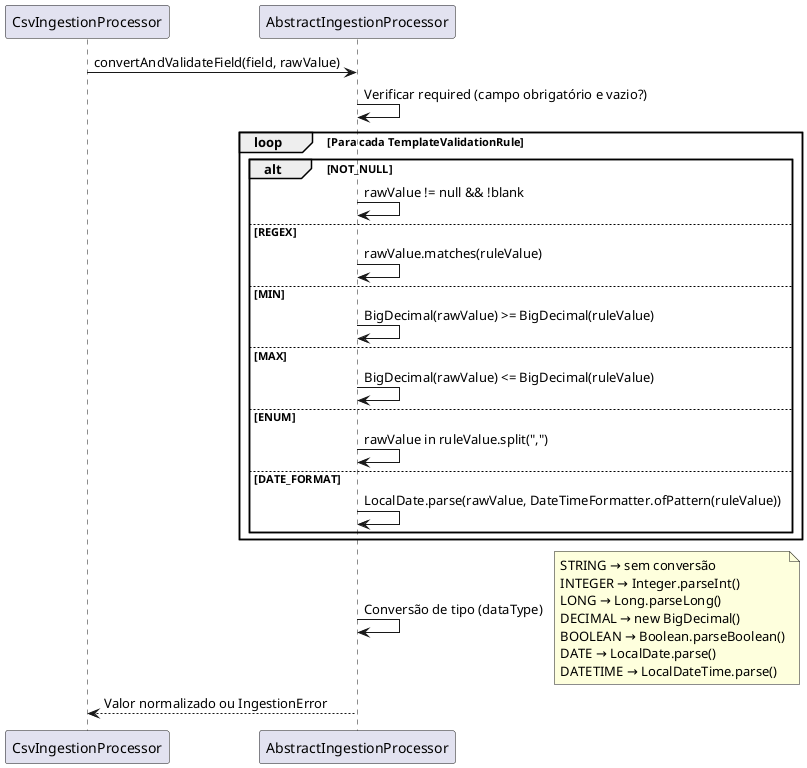

---

## 8. Spring Batch — Arquitectura de Jobs

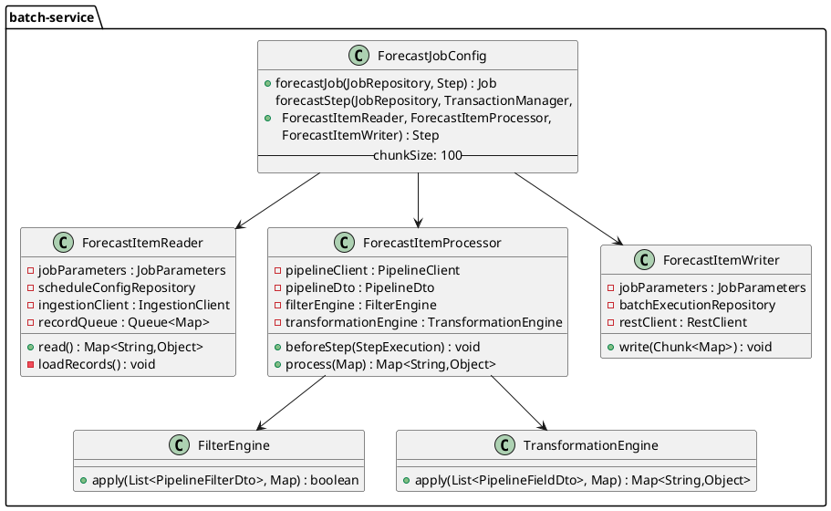

### Parâmetros do Job

| Parâmetro | Tipo | Fonte | Utilização |
|---|---|---|---|
| `scheduleConfigId` | Long | `BatchScheduleService.runJob()` | Reader e Processor |
| `batchExecutionId` | Long | `BatchScheduleService.runJob()` | Writer |
| `startedAt` | LocalDateTime | `BatchScheduleService.runJob()` | Timestamp de início |

### Configuração Spring Batch

```properties
spring.batch.job.enabled=false          # Jobs não auto-executam no startup
spring.batch.jdbc.initialize-schema=always  # Cria tabelas de metadata no H2
scheduling.enabled=true                 # Activa o cron poller
```

---

## 9. Motores de Processamento

### 9.1 FilterEngine

Avalia filtros de uma pipeline sobre um registo. Os filtros são aplicados por `orderIndex`. O `logicalOperator` de cada filtro define como combina com o seguinte (AND por defeito).

| Operador | Lógica |
|---|---|
| `EQ` | Campo == valor |
| `NEQ` | Campo != valor |
| `GT` | Campo > valor (numérico via BigDecimal; fallback lexicográfico) |
| `GTE` | Campo >= valor |
| `LT` | Campo < valor |
| `LTE` | Campo <= valor |
| `IN` | Campo contido em lista separada por vírgulas |
| `NOT_IN` | Campo não contido em lista separada por vírgulas |
| `IS_NULL` | Campo é null ou vazio |
| `IS_NOT_NULL` | Campo não é null nem vazio |
| `CONTAINS` | Campo contém substring |
| `BETWEEN` | Campo entre dois valores `"min,max"` |

### 9.2 TransformationEngine

Aplica transformações aos campos de um registo aceite pelo FilterEngine. Falhas de transformação são silenciosas — o valor original é devolvido sem alteração.

| Tipo | Comportamento | Configuração |
|---|---|---|
| `NONE` | Sem alteração | — |
| `RENAME` | Copia valor para `targetFieldName` | — |
| `SCALE` | Multiplica valor numérico por factor | `{"factor": "0.5"}` |
| `DATE_FORMAT` | Converte formato de data | `{"from": "dd/MM/yyyy", "to": "yyyy-MM-dd"}` |
| `CAST` | Conversão de tipo | — |
| `REPLACE` | Substituição por regex | `{"regex": "\\s+", "replacement": "_"}` |

### 9.3 IngestionProcessorFactory (Strategy Pattern)

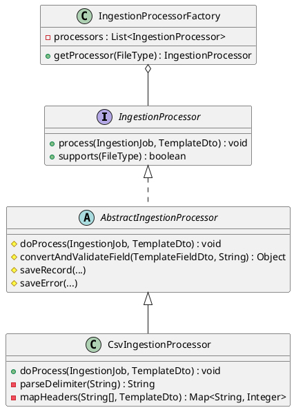

**Adicionar novo formato:** implementar `IngestionProcessor` (ou estender `AbstractIngestionProcessor`) e anotar com `@Service`. O `IngestionProcessorFactory` descobre automaticamente todos os beans.

---

## 10. Enumerações

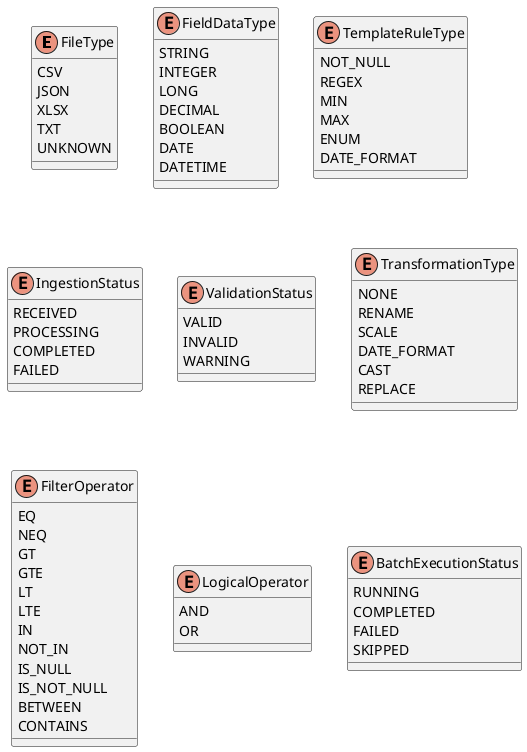

---

## 11. Tratamento de Erros

### GlobalExceptionHandler (core)

Aplica-se a todos os serviços via `@RestControllerAdvice`.

| Excepção | HTTP Status | Formato de Resposta |
|---|---|---|
| `ResourceNotFoundException` | 404 | `{"status": 404, "error": "Not Found", "message": "..."}` |
| `BadRequestException` | 400 | `{"status": 400, "error": "Bad Request", "message": "..."}` |
| `MethodArgumentNotValidException` | 400 | `{"status": 400, "error": "Bad Request", "message": "validation.failed", "details": ["campo: mensagem"]}` |
| `Exception` genérica | 500 | `{"status": 500, "error": "Internal Server Error", "message": "..."}` |

### Formato de Resposta de Erro
```json
{
  "status": 400,
  "error": "Bad Request",
  "message": "Mensagem de erro",
  "details": ["campo1: detalhe1", "campo2: detalhe2"]
}
```

### Internacionalização (I18n)

O `template-service` usa `MessageSource` para resolver chaves de mensagem (ex: `"error.template.not.found"`) em mensagens localizadas em Português.

---

## 12. Diagramas UML

### 12.1 Diagrama de Classes — Visão Geral

```plantuml
@startuml class-overview
package "template-service" {
  class IngestionTemplate
  class TemplateField
  class TemplateValidationRule
  class IngestionTemplateService
  class IngestionTemplateController
  IngestionTemplate "1" *-- "0..*" TemplateField
  TemplateField "1" *-- "0..*" TemplateValidationRule
  IngestionTemplateController --> IngestionTemplateService
}

package "ingestion-service" {
  class IngestionJob
  class IngestedRecord
  class IngestionError
  class IngestionService
  class IngestionController
  class CsvIngestionProcessor
  IngestionJob "1" *-- "0..*" IngestedRecord
  IngestionJob "1" *-- "0..*" IngestionError
  IngestedRecord "1" *-- "0..*" IngestionError
  IngestionController --> IngestionService
  IngestionService --> CsvIngestionProcessor
}

package "pipeline-service" {
  class ForecastPipeline
  class PipelineField
  class PipelineFilter
  class PipelineService
  class PipelineController
  ForecastPipeline "1" *-- "0..*" PipelineField
  ForecastPipeline "1" *-- "0..*" PipelineFilter
  PipelineController --> PipelineService
}

package "batch-service" {
  class BatchScheduleConfig
  class BatchExecution
  class BatchScheduleService
  class BatchController
  class ForecastItemReader
  class ForecastItemProcessor
  class ForecastItemWriter
  class FilterEngine
  class TransformationEngine
  BatchScheduleConfig "1" *-- "0..*" BatchExecution
  BatchController --> BatchScheduleService
  ForecastItemProcessor --> FilterEngine
  ForecastItemProcessor --> TransformationEngine
}

package "core" {
  class GlobalExceptionHandler
  class BadRequestException
  class ResourceNotFoundException
}
@enduml
```

### 12.2 Diagrama de Componentes

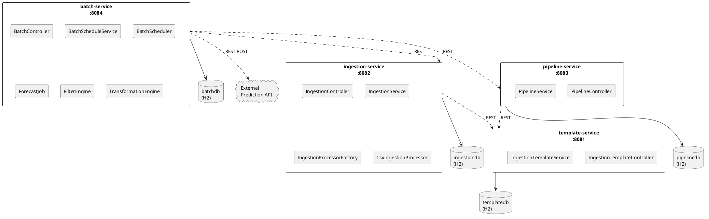

### 12.3 Diagrama de Estado — IngestionJob

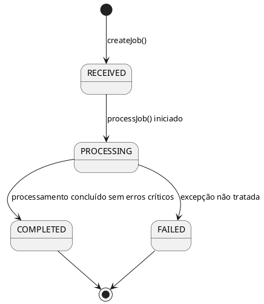

### 12.4 Diagrama de Estado — BatchExecution

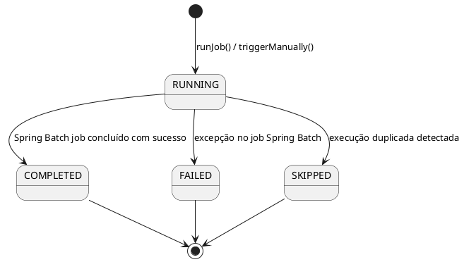

---

## Bases de Dados (Desenvolvimento Local)

| Serviço | JDBC URL | Console H2 |
|---|---|---|
| template-service | `jdbc:h2:mem:templatedb` | `http://localhost:8081/h2-console` |
| ingestion-service | `jdbc:h2:mem:ingestiondb` | `http://localhost:8082/h2-console` |
| pipeline-service | `jdbc:h2:mem:pipelinedb` | `http://localhost:8083/h2-console` |
| batch-service | `jdbc:h2:mem:batchdb` | `http://localhost:8084/h2-console` |

Todas as bases de dados usam `ddl-auto=update`. Para produção, alterar `spring.datasource.*` para PostgreSQL (driver já incluído em todos os serviços).

---

## Notas Técnicas Importantes

- **ObjectMapper**: `spring-boot-starter-webmvc` no Spring Boot 4 não auto-configura o `ObjectMapper`. Cada serviço declara um `@Bean` explícito em `JacksonConfig` com `JavaTimeModule` registado (datas como strings ISO-8601, não arrays).
- **Parsing CSV**: usa `String.split()` — não suporta campos entre aspas nem delimitadores escapados.
- **Resolução de campos CSV**: por `sourceName` contra o cabeçalho primeiro, depois `positionIndex` como fallback.
- **TransformationEngine**: falhas de transformação são silenciosas — o valor original é devolvido sem alteração.
- **BatchScheduler**: `lastRunTimes` é um Map em memória; no reinício do serviço, schedules que deveriam ter executado durante o downtime não são reprojetados.
- **Upload de ficheiros**: limite de 20MB configurado em `spring.servlet.multipart.max-file-size`.
- **Spring Security**: é dependência no template-service, mas sem autenticação em desenvolvimento local.
