# SalesPrevision — Documentação Técnica

## Índice

1. [Visão Geral da Arquitectura](#1-visão-geral-da-arquitectura)
2. [Estrutura de Módulos](#2-estrutura-de-módulos)
3. [Entidades e Modelo de Dados](#3-entidades-e-modelo-de-dados)
4. [Diagrama de Entidade-Relacionamento (ERD)](#4-diagrama-de-entidade-relacionamento-erd)
5. [Endpoints REST](#5-endpoints-rest)
6. [Comunicação Inter-Serviços](#6-comunicação-inter-serviços)
7. [Flows de Execução](#7-flows-de-execução)
8. [Spring Batch — Arquitectura de Jobs](#8-spring-batch--arquitectura-de-jobs)
9. [Motores de Processamento](#9-motores-de-processamento)
10. [Enumerações](#10-enumerações)
11. [Tratamento de Erros](#11-tratamento-de-erros)
12. [Diagramas UML](#12-diagramas-uml)
13. [Segurança e Multi-Tenancy](#13-segurança-e-multi-tenancy)
14. [Resiliência e Observabilidade](#14-resiliência-e-observabilidade)
15. [Perfis Spring e Containerização](#15-perfis-spring-e-containerização)

---

## 1. Visão Geral da Arquitectura

O SalesPrevision é um sistema de previsão de vendas baseado em microserviços. Ingere ficheiros de dados tabulares, valida-os contra templates configuráveis, aplica pipelines de selecção e transformação (incluindo variáveis contextuais/exógenas), e envia o resultado para um motor de previsão (interno, em Python, ou externo) num agendamento configurável. Todo o acesso passa por um gateway único, autenticado por JWT emitido por um serviço de identidade dedicado, e os dados de cada empresa (`companyId`) estão isolados entre si.

### Componentes Principais

```
┌─────────────────────────────────────────────────────────────────┐
│                         CLIENT / FRONTEND                        │
└────────────────────────────┬────────────────────────────────────┘
                             │ HTTP REST (JWT Bearer)
                             ▼
┌────────────────────────────────────────────────────────────────┐
│                   gateway-service (port 8080)                   │
│   Spring Cloud Gateway — valida JWT (JWKS do user-service),      │
│   13 rotas, circuit breaker por rota, único ponto de entrada     │
└───────┬──────────┬──────────┬──────────┬──────────┬─────────────┘
        │          │          │          │          │
        ▼          ▼          ▼          ▼          ▼
┌──────────────┐┌──────────────┐┌──────────────┐┌──────────────┐┌──────────────────┐
│template-svc  ││ingestion-svc ││pipeline-svc  ││batch-service ││prediction-service│
│  :8081       ││  :8082       ││  :8083       ││  :8084       ││  :8085 (Python)  │
│Templates,    ││Upload, Kafka ││Pipelines,    ││Spring Batch: ││ARIMA/ML, EXOG,   │
│campos,       ││async + valid.││campos, EXOG, ││agenda, lê,   ││features de data  │
│regras        ││registos      ││filtros       ││transforma,   ││                  │
│              ││              ││              ││envia         ││                  │
└──────┬───────┘└──────┬───────┘└──────┬───────┘└──┬───┬───┬───┘└──────────────────┘
       │                │                │          │   │   │
       │ REST (via gateway, Resilience4j) │          │   │   │
       └────────────────┴────────────────┘          │   │   │
                                                      │   │   │
                              ┌───────────────────────┘   │   └──────────► HTTP POST
                              │ REST (direto, Resilience4j)│              (chunks de 100)
                              ▼                            ▼
                    pipeline-service              ingestion-service

┌──────────────────────────────────────────────────────────────────┐
│                    user-service (port 8086)                      │
│  Company / User / ServiceRole — emite JWT (RS256), publica JWKS   │
│  em /.well-known/jwks.json. Todos os outros serviços validam      │
│  tokens contra este JWKS.                                         │
└──────────────────────────────────────────────────────────────────┘

┌──────────────────────────────────────────────────────────────────┐
│  Kafka (KRaft) — processamento assíncrono de ingestão             │
│  (IngestionJobEvent, consumer + dead-letter-topic)                │
└──────────────────────────────────────────────────────────────────┘
```

`core` é uma biblioteca partilhada (sem porta própria) usada por todos os serviços Java: DTOs, enumerações, excepções, infraestrutura de i18n e de autenticação de serviço (`service-auth`/`token-relay`).

### Tecnologias

| Tecnologia | Versão | Utilização |
|---|---|---|
| Java | 17 | Linguagem (6 serviços + core) |
| Python | 3.12 | Motor de previsão (prediction-service) |
| Spring Boot | 4.0 | Framework principal |
| Spring Cloud Gateway | — | Ponto de entrada único, roteamento reativo (gateway-service) |
| Spring Security OAuth2 Resource Server | — | Validação de JWT (RS256) via JWKS em todos os serviços |
| Spring Batch | — | Orquestração de jobs (batch-service) |
| Spring Data JPA | — | Persistência |
| Resilience4j | — | Retry + circuit breaker nas chamadas inter-serviços |
| Spring Boot Actuator | — | Health/info/metrics em todos os serviços backend |
| Apache Kafka (KRaft) | — | Processamento assíncrono de ingestão |
| MapStruct | — | Mapeamento de entidades |
| H2 Database | — | BD em memória (perfil `dev`) |
| PostgreSQL | — | BD para produção (driver incluído, perfil ainda por criar) |
| Docker / Docker Compose | — | Containerização — um `Dockerfile` independente por serviço |
| Jackson | — | Serialização JSON |
| Lombok | — | Redução de boilerplate |
| Maven | — | Build e gestão de dependências |
| FastAPI / statsmodels / scikit-learn / XGBoost | — | prediction-service (Python) |

---

## 2. Estrutura de Módulos

```
salesPrevision/
├── core/                          ← biblioteca partilhada (DTOs, enums, excepções, i18n, service-auth)
├── template-service/              ← porta 8081
├── ingestion-service/             ← porta 8082
├── pipeline-service/              ← porta 8083
├── batch-service/                 ← porta 8084
├── gateway-service/                ← porta 8080 (Spring Cloud Gateway)
├── user-service/                  ← porta 8086 (identidade, JWT, JWKS)
├── prediction-service/             ← porta 8085 (Python/FastAPI, fora do reactor Maven)
├── docker-compose.yml              ← Kafka + todos os serviços
└── pom.xml                        ← parent POM (7 módulos Maven)
```

### Estrutura de Pacotes por Módulo

#### core
```
com.uab.core
├── dto/
│   ├── ingestion/       TemplateDto, IngestionJobResponse, IngestedRecordResponse,
│   │                    IngestionErrorResponse, CreateIngestionJobResponse
│   ├── pipeline/        PipelineDto
│   └── template/        CreateIngestionTemplateRequest, IngestionTemplateResponse,
│                        TemplateFieldRequest/Response, TemplateValidationRuleRequest/Response
├── enums/               BatchExecutionStatus, FieldDataType, FileType, FilterOperator,
│                        ForecastFieldRole, IngestionStatus, LogicalOperator, ServiceRole,
│                        TemplateRuleType, TransformationType, ValidationStatus
├── exception/           BadRequestException, ResourceNotFoundException,
│                        ServiceUnavailableException, GlobalExceptionHandler
├── correlation/         CorrelationIdFilter, CorrelationIdAutoConfiguration
├── serviceauth/         ServiceTokenProvider, ServiceAuthRestClientInterceptor
└── tokenrelay/          Infraestrutura de relay de token entre serviços
```

#### template-service
```
com.uab.salesprevision.template
├── config/              I18nConfig
├── controller/          IngestionTemplateController
├── entity/              IngestionTemplate, TemplateField, TemplateValidationRule
├── mappers/             TemplateEntitiesMapper (MapStruct)
├── repository/          IngestionTemplateRepository, TemplateFieldRepository,
│                        TemplateValidationRuleRepository
└── service/             IngestionTemplateService
```

#### ingestion-service
```
com.uab.salesprevision.ingestion
├── client/              TemplateClient
├── config/              JacksonConfig
├── controller/          IngestionController
├── entity/              IngestionJob, IngestedRecord, IngestionError
├── mappers/             IngestionEntitiesMapper (MapStruct)
├── repository/          IngestionJobRepository, IngestedRecordRepository,
│                        IngestionErrorRepository
└── service/
    ├── IngestionService
    ├── IngestionRecordFactory
    └── ingestion/       IngestionProcessor (interface), AbstractIngestionProcessor,
                         CsvIngestionProcessor, IngestionProcessorFactory
```

#### pipeline-service
```
com.uab.salesprevision.pipeline
├── client/              TemplateClient
├── config/              JacksonConfig
├── controller/          PipelineController
├── dto/                 CreateForecastPipelineRequest, ForecastPipelineResponse
├── entity/              ForecastPipeline, PipelineField, PipelineFilter
├── mapper/              PipelineMapper (MapStruct)
├── repository/          ForecastPipelineRepository
└── service/             PipelineService
```

#### batch-service
```
com.uab.salesprevision.batch
├── batch/               ForecastJobConfig, ForecastItemReader (@StepScope),
│                        ForecastItemProcessor (@StepScope), ForecastItemWriter (@StepScope)
├── client/              IngestionClient, PipelineClient (Resilience4j @Retry/@CircuitBreaker)
├── config/              JacksonConfig
├── controller/          BatchController
├── dto/                 CreateBatchScheduleRequest, BatchScheduleResponse,
│                        BatchExecutionResponse
├── engine/              FilterEngine, TransformationEngine
├── model/               BatchScheduleConfig (com lastRunAt), BatchExecution
├── repository/          BatchScheduleConfigRepository, BatchExecutionRepository
├── scheduler/           BatchScheduler (lê/escreve lastRunAt via repositório)
└── service/             BatchScheduleService
```

#### gateway-service
```
com.uab.salesprevision.gateway
├── config/              SecurityConfig (valida JWT via JWKS do user-service)
├── controller/          FallbackController (resposta de circuit breaker aberto)
└── application.properties  13 rotas (Spring Cloud Gateway webflux) para os 6 outros
                            serviços + prediction-service, cada uma com filtro CircuitBreaker
```

#### user-service
```
com.uab.salesprevision.user
├── config/              SecurityConfig (auto-referência ao próprio JWKS), I18nConfig
├── controller/          AuthController (/auth/login), UserController, CompanyController,
│                        JwksController (/.well-known/jwks.json)
├── model/               Company, User (roles : Set<ServiceRole> via @ElementCollection)
├── repository/          UserRepository, CompanyRepository
├── security/            JwtTokenService (RS256), RsaKeyUtils
└── service/             UserService, CompanyService
```

#### prediction-service (Python, fora do reactor Maven)
```
app/
├── api/                 forecast.py, models_info.py
├── models/
│   ├── base.py          BaseForecaster (supports_exog)
│   ├── statistical/     arima.py (ARIMA com suporte a exog)
│   └── ml/              feature_builder.py (day_of_week/is_weekend se frequency="D"),
│                        base_ml.py, linear_regression.py, random_forest.py, xgboost_forecaster.py
├── schemas/             config.py (PipelineConfig.exog_fields), forecast.py
├── security/            auth.py (valida JWT via JWKS_URL)
└── service/             preprocessor.py, forecast_service.py
```

---

## 3. Entidades e Modelo de Dados

### 3.1 template-service

#### IngestionTemplate
| Campo | Tipo | Restrições | Notas |
|---|---|---|---|
| `id` | Long | PK, auto-gerado | |
| `companyId` | Long | obrigatório | Multi-tenancy — `UNIQUE(companyId, name)` |
| `name` | String(150) | único por empresa, obrigatório | |
| `description` | String(1000) | | |
| `fileType` | FileType | enum | CSV, JSON, XLSX, TXT, UNKNOWN |
| `delimiter` | String(10) | | Apenas CSV |
| `hasHeader` | Boolean | default `true` | |
| `sheetName` | String(150) | | Apenas XLSX |
| `rootPath` | String(255) | | Caminho raiz para JSON |
| `version` | Integer | default `1` | |
| `active` | Boolean | default `true` | |
| `createdAt` | LocalDateTime | auto | |
| `updatedAt` | LocalDateTime | auto | |

#### TemplateField
| Campo | Tipo | Restrições | Notas |
|---|---|---|---|
| `id` | Long | PK | |
| `template` | ManyToOne | cascade all | |
| `fieldName` | String(120) | obrigatório | Nome canónico no sistema |
| `sourceName` | String(120) | | Nome da coluna no ficheiro de origem |
| `dataType` | FieldDataType | enum | STRING, INTEGER, LONG, DECIMAL, BOOLEAN, DATE, DATETIME |
| `required` | Boolean | | |
| `positionIndex` | Integer | | Índice de posição (ficheiros sem cabeçalho) |
| `dateFormat` | String(50) | | Formato de data |
| `defaultValue` | String(255) | | |
| `validationRegex` | String(500) | | |
| `targetPath` | String(255) | | |
| `active` | Boolean | | |

#### TemplateValidationRule
| Campo | Tipo | Restrições | Notas |
|---|---|---|---|
| `id` | Long | PK | |
| `field` | ManyToOne | cascade all | |
| `ruleType` | TemplateRuleType | enum | NOT_NULL, REGEX, MIN, MAX, ENUM, DATE_FORMAT |
| `ruleValue` | String(500) | | Valor de regra (padrão regex, valor min, lista ENUM) |
| `message` | String(500) | | Mensagem customizada (fallback para mensagem em Português) |
| `active` | Boolean | | |

---

### 3.2 ingestion-service

#### IngestionJob
| Campo | Tipo | Restrições | Notas |
|---|---|---|---|
| `id` | Long | PK | |
| `companyId` | Long | obrigatório | Multi-tenancy |
| `templateId` | Long | | Referência ao template-service (não JPA) |
| `templateName` | String(150) | | Desnormalizado |
| `status` | IngestionStatus | enum | RECEIVED → PROCESSING → COMPLETED / FAILED |
| `originalFileName` | String(255) | | |
| `storedFileName` | String(255) | | `{UUID}_{nome_sanitizado}` |
| `contentType` | String(100) | | |
| `fileSize` | Long | | Bytes |
| `storagePath` | String(500) | | Caminho absoluto em `uploads/template_{id}/` |
| `checksum` | String(128) | | SHA-256 hex |
| `startedAt` | LocalDateTime | | |
| `finishedAt` | LocalDateTime | | |
| `createdAt` | LocalDateTime | auto | |
| `createdBy` | String(100) | | |
| `errorMessage` | String(4000) | | Definido quando status = FAILED |
| `recordCount` | Long | | |
| `errorCount` | Long | | |

#### IngestedRecord
| Campo | Tipo | Restrições | Notas |
|---|---|---|---|
| `id` | Long | PK | |
| `ingestionJob` | ManyToOne | | |
| `recordIndex` | Long | | Número de linha (1-based) |
| `rawPayload` | TEXT (LOB) | | JSON com valores originais |
| `normalizedPayload` | TEXT (LOB) | | JSON com valores após conversão de tipos |
| `validationStatus` | ValidationStatus | enum | VALID, INVALID, WARNING |
| `createdAt` | LocalDateTime | auto | |

#### IngestionError
| Campo | Tipo | Restrições | Notas |
|---|---|---|---|
| `id` | Long | PK | |
| `ingestionJob` | ManyToOne | | |
| `record` | ManyToOne | opcional | |
| `fieldName` | String(100) | | |
| `errorType` | String(100) | | VALIDATION, REGEX, TYPE_CONVERSION, NOT_NULL, MIN, MAX, ENUM, DATE_FORMAT |
| `message` | String(4000) | | Mensagem em Português |
| `rawValue` | String(1000) | | Valor original do ficheiro |
| `lineNumber` | Long | | |
| `createdAt` | LocalDateTime | auto | |

---

### 3.3 pipeline-service

#### ForecastPipeline
| Campo | Tipo | Restrições | Notas |
|---|---|---|---|
| `id` | Long | PK | |
| `companyId` | Long | obrigatório | Multi-tenancy |
| `templateId` | Long | | Referência ao template-service |
| `templateName` | String(150) | | Desnormalizado |
| `name` | String(150) | único | |
| `description` | String(1000) | | |
| `active` | Boolean | | |
| `createdAt` | LocalDateTime | auto | |
| `updatedAt` | LocalDateTime | auto | |

#### PipelineField
| Campo | Tipo | Restrições | Notas |
|---|---|---|---|
| `id` | Long | PK | |
| `pipeline` | ManyToOne | cascade all | |
| `sourceFieldName` | String(120) | | Campo em `normalizedPayload` |
| `targetFieldName` | String(120) | | Chave no payload da API de previsão |
| `transformationType` | TransformationType | enum | NONE, RENAME, SCALE, DATE_FORMAT, CAST, REPLACE |
| `transformationConfig` | TEXT | | JSON com parâmetros da transformação |
| `positionIndex` | Integer | | Ordenação do output |
| `active` | Boolean | | |
| `forecastRole` | ForecastFieldRole | default `NONE` | NONE, DATE, TARGET, GROUP, EXOG — deriva a config de previsão automaticamente (ver §9.4) |
| `aggregation` | String | opcional | Relevante quando `forecastRole=TARGET` ou `EXOG` (sum/mean/last/max/min) |

**Configurações de Transformação (JSON):**
| Tipo | Configuração |
|---|---|
| `SCALE` | `{"factor": "0.01"}` |
| `DATE_FORMAT` | `{"from": "dd/MM/yyyy", "to": "yyyy-MM-dd"}` |
| `REPLACE` | `{"regex": "\\s+", "replacement": "_"}` |
| `NONE` / `RENAME` / `CAST` | Sem configuração necessária |

#### PipelineFilter
| Campo | Tipo | Restrições | Notas |
|---|---|---|---|
| `id` | Long | PK | |
| `pipeline` | ManyToOne | cascade all | |
| `fieldName` | String(120) | | Campo em `normalizedPayload` |
| `operator` | FilterOperator | enum | EQ, NEQ, GT, GTE, LT, LTE, IN, NOT_IN, IS_NULL, IS_NOT_NULL, BETWEEN, CONTAINS |
| `value` | String(500) | | Valor de comparação; IN/NOT_IN usam lista separada por vírgulas; BETWEEN usa "min,max" |
| `logicalOperator` | LogicalOperator | enum | AND / OR — como este filtro combina com o seguinte |
| `orderIndex` | Integer | | Ordem de avaliação |

---

### 3.4 batch-service

#### BatchScheduleConfig
| Campo | Tipo | Restrições | Notas |
|---|---|---|---|
| `id` | Long | PK | |
| `companyId` | Long | obrigatório | Multi-tenancy |
| `pipelineId` | Long | | Referência ao pipeline-service |
| `pipelineName` | String(150) | | Desnormalizado |
| `cronExpression` | String(150) | | Cron standard Spring de 6 partes |
| `lookbackDays` | Integer | default `7` | Janela temporal de jobs a ler |
| `predictionApiUrl` | String(500) | | URL da API de previsão (externa ou o próprio prediction-service) |
| `active` | Boolean | | Schedules inactivos são ignorados |
| `internalPrediction` | Boolean | default `false` | Só `true` quando `predictionApiUrl` aponta para o nosso prediction-service — o `ForecastItemWriter` só anexa o token de serviço interno neste caso |
| `createdBy` | String(100) | | |
| `createdAt` | LocalDateTime | auto | |
| `updatedAt` | LocalDateTime | auto | |
| `lastRunAt` | LocalDateTime | opcional | Persistido pelo `BatchScheduler` a cada disparo — substitui o antigo `Map` em memória, sobrevive a reinícios |

#### BatchExecution
| Campo | Tipo | Restrições | Notas |
|---|---|---|---|
| `id` | Long | PK | |
| `scheduleConfig` | ManyToOne | | |
| `springBatchJobExecutionId` | Long | | Referência cruzada com tabelas do Spring Batch |
| `status` | BatchExecutionStatus | enum | RUNNING, COMPLETED, FAILED, SKIPPED |
| `startedAt` | LocalDateTime | | |
| `finishedAt` | LocalDateTime | | |
| `recordsSent` | Long | | |
| `recordsFailed` | Long | | |
| `errorMessage` | String(4000) | | |
| `createdAt` | LocalDateTime | auto | |

---

### 3.5 user-service

#### Company
| Campo | Tipo | Restrições | Notas |
|---|---|---|---|
| `id` | Long | PK | |
| `name` | String(150) | único, obrigatório | |

#### User
| Campo | Tipo | Restrições | Notas |
|---|---|---|---|
| `id` | Long | PK | |
| `username` | String(100) | único, obrigatório | |
| `passwordHash` | String(255) | obrigatório | BCrypt |
| `company` | ManyToOne (EAGER) | obrigatório | Carregado sempre — o login lê a empresa fora de qualquer transação |
| `roles` | Set\<ServiceRole\> | `@ElementCollection` | Tabela `user_roles`; um "admin" é apenas um utilizador com todos os valores de `ServiceRole` |
| `active` | Boolean | default `true` | |

Não existe entidade `Role` separada nem papéis fixos (ADMIN/USER) — os papéis são um conjunto de valores do enum `ServiceRole` (ver §10), atribuídos diretamente a cada utilizador.

---

## 4. Diagrama de Entidade-Relacionamento (ERD)

### template-service ERD
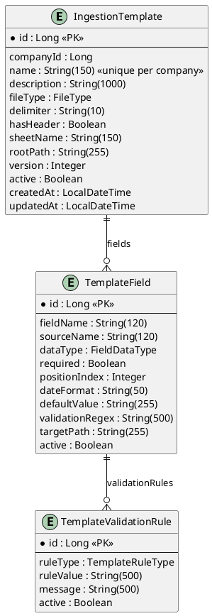

### ingestion-service ERD
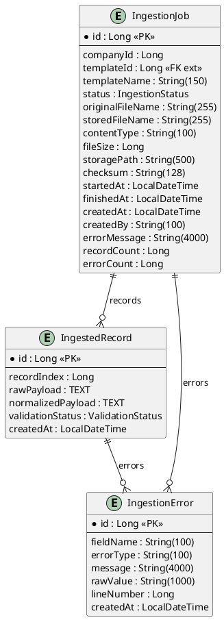

### pipeline-service ERD
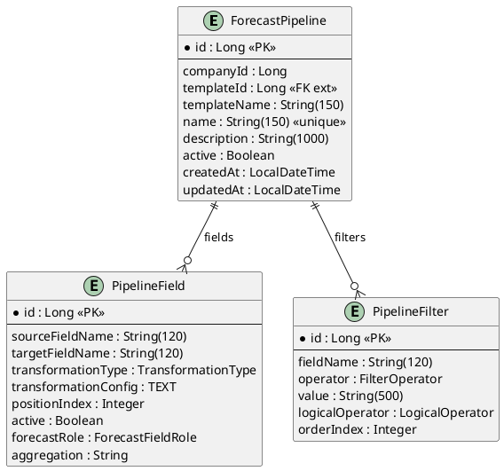

### batch-service ERD
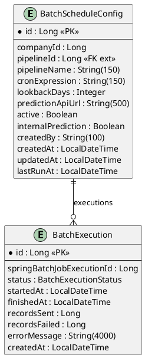

### user-service ERD
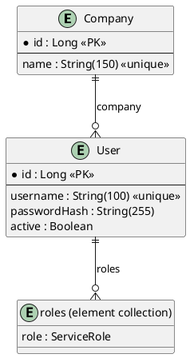

---

## 5. Endpoints REST

Todos os endpoints abaixo (exceto `/auth/login` e os públicos como `/actuator/**`, `/h2-console/**`, Swagger) exigem um JWT válido (`Authorization: Bearer ...`), emitido pelo `user-service`. A coluna **Role** indica o `ServiceRole` exigido além de autenticação válida.

### gateway-service — `http://localhost:8080` (ponto de entrada único, recomendado)

13 rotas Spring Cloud Gateway, cada uma com filtro `CircuitBreaker` + fallback `forward:/fallback/service-unavailable`: 4 rotas de proxy de documentação OpenAPI (`/v3/api-docs/{service}`) + rotas funcionais para os 6 serviços seguintes + `prediction-service` (`/api/forecast/**`, `/api/config/**`, `/api/models/**`) + `user-service` (`/auth/login`, `/api/users/**`, `/api/companies/**`). Basta apontar o cliente para `:8080` e usar os mesmos paths documentados abaixo.

### user-service — `http://localhost:8086`

| Método | Endpoint | Role | Descrição |
|---|---|---|---|
| POST | `/auth/login` | público | Autentica, devolve JWT (RS256) com `roles` e `companyId` |
| GET | `/.well-known/jwks.json` | público | Chave pública para validação de JWT (consumida por todos os outros serviços) |
| POST | `/api/users` | `USER_EDIT` | Criar utilizador |
| GET | `/api/users` | `USER_READ` | Listar utilizadores |
| POST | `/api/companies` | `USER_EDIT` | Criar empresa |
| GET | `/api/companies` | `USER_READ` | Listar empresas |

### template-service — `http://localhost:8081`

| Método | Endpoint | Role | Request | Response | Descrição |
|---|---|---|---|---|---|
| POST | `v1/api/templates` | `TEMPLATE_EDIT` | `CreateIngestionTemplateRequest` | `IngestionTemplateResponse` | Criar template com campos e regras |
| GET | `v1/api/templates` | `TEMPLATE_READ` | — | `List<IngestionTemplateResponse>` | Listar templates da empresa do utilizador |
| GET | `v1/api/templates/{id}` | `TEMPLATE_READ` | — | `IngestionTemplateResponse` | Obter template por ID |

### ingestion-service — `http://localhost:8082`

| Método | Endpoint | Role | Request | Response | Descrição |
|---|---|---|---|---|---|
| POST | `v1/api/ingestion/jobs` | `INGESTION_EDIT` | `multipart/form-data`: `file`, `templateId`, `createdBy?`, `autoProcess?` | `CreateIngestionJobResponse` | Upload de ficheiro; se `autoProcess=true` (default), publica evento Kafka para processamento assíncrono |
| POST | `v1/api/ingestion/jobs/{jobId}/process` | `INGESTION_EXECUTE` | — | 202 Accepted (sem corpo) | Publica evento Kafka para (re)processar um job em RECEIVED — não bloqueia à espera do resultado |
| GET | `v1/api/ingestion/jobs` | `INGESTION_READ` | Query: `templateId?`, `status?` | `List<IngestionJobResponse>` | Listar jobs com filtros |
| GET | `v1/api/ingestion/jobs/{jobId}` | `INGESTION_READ` | — | `IngestionJobResponse` | Detalhes do job |
| GET | `v1/api/ingestion/jobs/{jobId}/records` | `INGESTION_READ` | `Pageable` | `Page<IngestedRecordResponse>` | Registos ingeridos (paginado) |
| GET | `v1/api/ingestion/jobs/{jobId}/errors` | `INGESTION_READ` | `Pageable` | `Page<IngestionErrorResponse>` | Erros de validação (paginado) |

### pipeline-service — `http://localhost:8083`

| Método | Endpoint | Role | Request | Response | Descrição |
|---|---|---|---|---|---|
| POST | `v1/api/pipelines` | `PIPELINE_EDIT` | `CreateForecastPipelineRequest` | `ForecastPipelineResponse` | Criar pipeline |
| GET | `v1/api/pipelines` | `PIPELINE_READ` | Query: `templateId?` | `List<ForecastPipelineResponse>` | Listar pipelines |
| GET | `v1/api/pipelines/{id}` | `PIPELINE_READ` | — | `ForecastPipelineResponse` | Detalhes da pipeline |
| GET | `v1/api/pipelines/{id}/dto` | `PIPELINE_READ` | — | `PipelineDto` | DTO consumido pelo batch-service |

### batch-service — `http://localhost:8084`

| Método | Endpoint | Role | Request | Response | Descrição |
|---|---|---|---|---|---|
| POST | `/api/batch/schedules` | `BATCH_EDIT` | `CreateBatchScheduleRequest` | `BatchScheduleResponse` | Criar agendamento de batch |
| GET | `/api/batch/schedules` | `BATCH_READ` | — | `List<BatchScheduleResponse>` | Listar agendamentos |
| GET | `/api/batch/schedules/{id}` | `BATCH_READ` | — | `BatchScheduleResponse` | Detalhes do agendamento |
| GET | `/api/batch/schedules/{id}/executions` | `BATCH_READ` | `Pageable` | `Page<BatchExecutionResponse>` | Histórico de execuções (paginado) |
| POST | `/api/batch/schedules/{id}/trigger` | `BATCH_EXECUTE` | — | `BatchExecutionResponse` | Disparar execução manual (202 Accepted) |

> Nota: `ingestion-service` e `pipeline-service` já usam o prefixo `v1/`, uniformizado com o `template-service`; `batch-service` e `user-service` ainda não — item ainda aberto na checklist de melhorias.

---

## 6. Comunicação Inter-Serviços

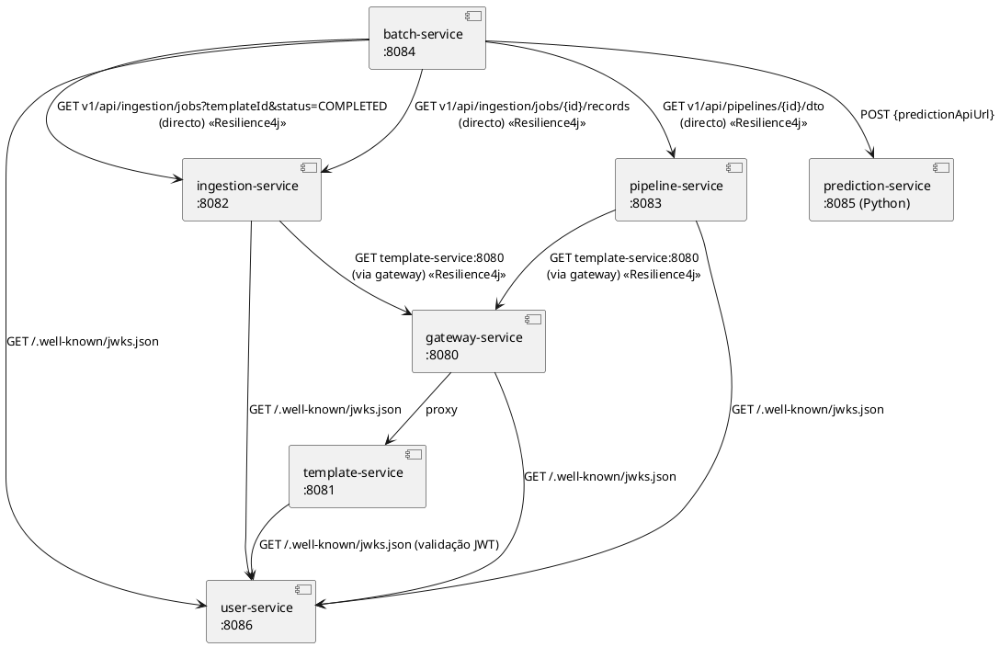

### Clientes REST

Todos os clientes usam `RestClient` (Spring 6.1+) configurado via `application.properties`/`application-docker.properties`.

| Serviço | Cliente | Endpoints Consumidos | Resiliência |
|---|---|---|---|
| ingestion-service | `TemplateClient` | `GET v1/api/templates/{templateId}` (via gateway) | `@Retry` + `@CircuitBreaker` |
| pipeline-service | `TemplateClient` | `GET v1/api/templates/{templateId}` (via gateway) | `@Retry` + `@CircuitBreaker` |
| batch-service | `PipelineClient` | `GET v1/api/pipelines/{pipelineId}/dto` (directo) | `@Retry` + `@CircuitBreaker` |
| batch-service | `IngestionClient` | `GET v1/api/ingestion/jobs?templateId&status=COMPLETED` (directo) | `@Retry` + `@CircuitBreaker` |
| batch-service | `IngestionClient` | `GET v1/api/ingestion/jobs/{jobId}/records?page&size` (directo) | `@Retry` + `@CircuitBreaker` |

Erros HTTP 4xx (`ResourceNotFoundException`) são explicitamente excluídos do retry e do circuit breaker — um 404 é um resultado de negócio legítimo, não uma falha transitória. Quando as tentativas de retry se esgotam por falha genuína, o método de fallback lança `ServiceUnavailableException` (`core`), mapeada para HTTP 503 (ver §11 e §14).

---

## 7. Flows de Execução

### 7.1 Flow de Ingestão de Ficheiro

Desde a introdução do Kafka, o pedido HTTP só cria o job e devolve — o processamento real (parsing, validação, normalização) corre de forma assíncrona no consumer.

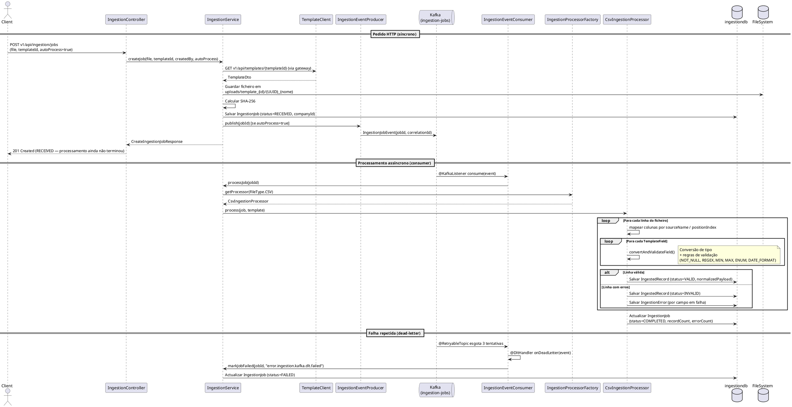

O cliente descobre o resultado consultando `GET v1/api/ingestion/jobs/{jobId}` depois de submeter o ficheiro — não há um callback ou webhook de conclusão.

### 7.2 Flow de Configuração de Pipeline

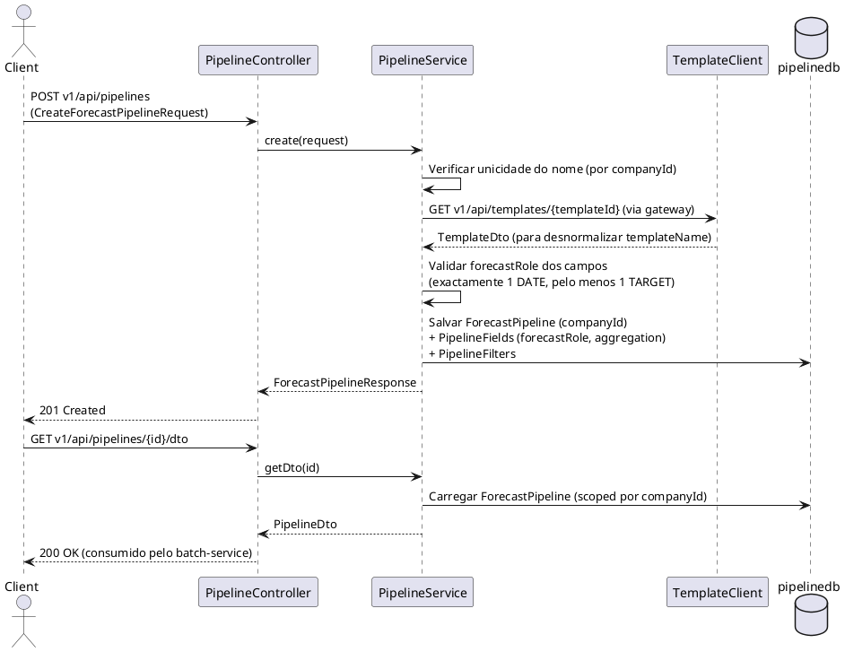

### 7.3 Flow de Execução Batch

```plantuml
@startuml batch-flow
participant "BatchScheduler\n(a cada 60s)" as SCHED
participant "BatchScheduleService" as BSS
participant "JobLauncher\n(Spring Batch)" as JL
participant "ForecastItemReader" as READER
participant "IngestionClient" as IC
participant "ForecastItemProcessor" as PROC
participant "PipelineClient" as PC
participant "ForecastItemWriter" as WRITER
database "batchdb" as DB
cloud "External\nPrediction API" as EXT

SCHED -> SCHED : checkSchedules() — avaliar cron expressions\ncontra lastRunAt (persistido, não Map em memória)
SCHED -> DB : Actualizar BatchScheduleConfig.lastRunAt
SCHED -> BSS : runJob(config) [se schedule activo e due]
BSS -> DB : Salvar BatchExecution (status=RUNNING)
BSS -> JL : run(forecastJob, {scheduleConfigId, batchExecutionId, startedAt})

JL -> READER : @BeforeStep — carregar parâmetros do job
READER -> DB : Carregar BatchScheduleConfig
READER -> PC : GET /api/pipelines/{pipelineId}/dto
note right: Resolve o templateId real do pipeline\n(correcção: antes usava, por engano,\no próprio id do pipeline)
PC --> READER : PipelineDto (com templateId)
READER -> IC : GET /api/ingestion/jobs?templateId&status=COMPLETED
IC --> READER : Lista de IngestionJobResponse
loop Para cada job dentro da janela lookbackDays
  READER -> IC : GET /api/ingestion/jobs/{id}/records (paginado, 200/página)
  IC --> READER : Página de IngestedRecordResponse
  READER -> READER : Desserializar normalizedPayload → Map<String,Object>
end

loop Para cada chunk de 100 registos
  JL -> PROC : process(record)
  note right: @BeforeStep — carregar PipelineDto uma vez
  PROC -> PC : GET /api/pipelines/{id}/dto (uma vez por step)
  PC --> PROC : PipelineDto
  PROC -> PROC : FilterEngine.apply(filters, record)
  alt Registo filtrado (excluído)
    PROC --> JL : null (Spring Batch ignora)
  else Registo aceite
    PROC -> PROC : TransformationEngine.apply(fields, record)
    PROC --> JL : Map<String,Object> transformado
  end
  JL -> WRITER : write(chunk)
  WRITER -> EXT : POST {predictionApiUrl}\n{pipelineId, pipelineName, scheduleConfigId,\n batchExecutionId, recordCount, records:[...]}
  EXT --> WRITER : Response
  WRITER -> DB : Actualizar recordsSent / recordsFailed
end

JL -> BSS : Job concluído
BSS -> DB : Actualizar BatchExecution (status=COMPLETED/FAILED, finishedAt)
@enduml
```

### 7.4 Flow de Validação de Campos (Ingestão CSV)

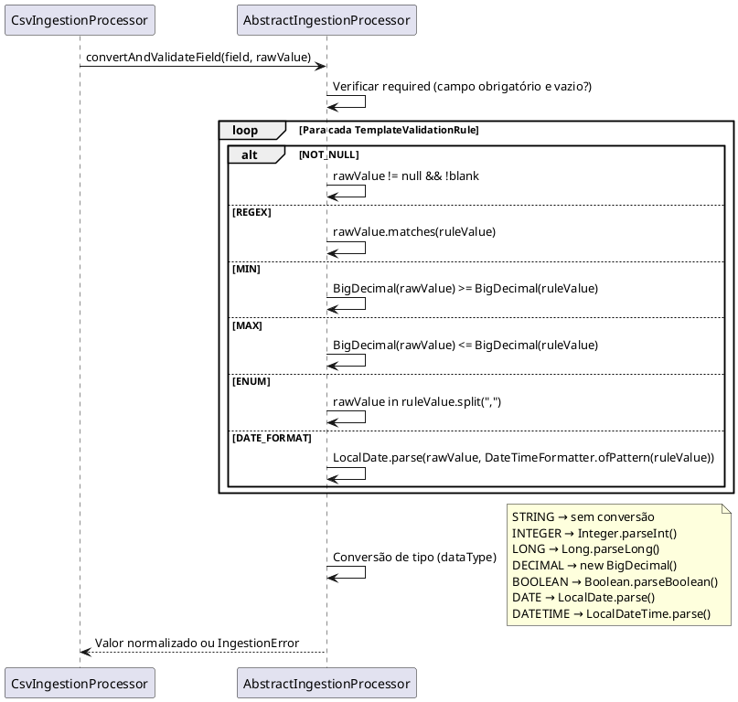

---

## 8. Spring Batch — Arquitectura de Jobs

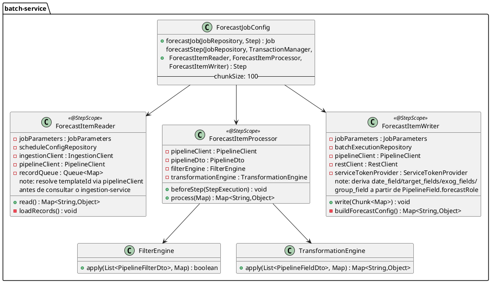

### Parâmetros do Job

| Parâmetro | Tipo | Fonte | Utilização |
|---|---|---|---|
| `scheduleConfigId` | Long | `BatchScheduleService.runJob()` | Reader e Processor |
| `batchExecutionId` | Long | `BatchScheduleService.runJob()` | Writer |
| `startedAt` | LocalDateTime | `BatchScheduleService.runJob()` | Timestamp de início |

### Configuração Spring Batch

```properties
spring.batch.job.enabled=false          # Jobs não auto-executam no startup
spring.batch.jdbc.initialize-schema=always  # Cria tabelas de metadata no H2
scheduling.enabled=true                 # Activa o cron poller
```

---

## 9. Motores de Processamento

### 9.1 FilterEngine

Avalia filtros de uma pipeline sobre um registo. Os filtros são aplicados por `orderIndex`. O `logicalOperator` de cada filtro define como combina com o seguinte (AND por defeito).

| Operador | Lógica |
|---|---|
| `EQ` | Campo == valor |
| `NEQ` | Campo != valor |
| `GT` | Campo > valor (numérico via BigDecimal; fallback lexicográfico) |
| `GTE` | Campo >= valor |
| `LT` | Campo < valor |
| `LTE` | Campo <= valor |
| `IN` | Campo contido em lista separada por vírgulas |
| `NOT_IN` | Campo não contido em lista separada por vírgulas |
| `IS_NULL` | Campo é null ou vazio |
| `IS_NOT_NULL` | Campo não é null nem vazio |
| `CONTAINS` | Campo contém substring |
| `BETWEEN` | Campo entre dois valores `"min,max"` |

### 9.2 TransformationEngine

Aplica transformações aos campos de um registo aceite pelo FilterEngine. Falhas de transformação são silenciosas — o valor original é devolvido sem alteração.

| Tipo | Comportamento | Configuração |
|---|---|---|
| `NONE` | Sem alteração | — |
| `RENAME` | Copia valor para `targetFieldName` | — |
| `SCALE` | Multiplica valor numérico por factor | `{"factor": "0.5"}` |
| `DATE_FORMAT` | Converte formato de data | `{"from": "dd/MM/yyyy", "to": "yyyy-MM-dd"}` |
| `CAST` | Conversão de tipo | — |
| `REPLACE` | Substituição por regex | `{"regex": "\\s+", "replacement": "_"}` |

### 9.3 IngestionProcessorFactory (Strategy Pattern)

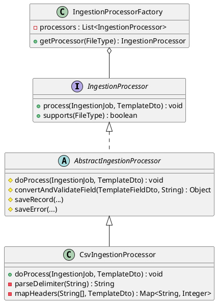

**Adicionar novo formato:** implementar `IngestionProcessor` (ou estender `AbstractIngestionProcessor`) e anotar com `@Service`. O `IngestionProcessorFactory` descobre automaticamente todos os beans.

### 9.4 Derivação da Configuração de Previsão (EXOG)

`ForecastItemWriter.buildForecastConfig()` deriva a configuração enviada ao motor de previsão diretamente dos `PipelineField.forecastRole` — não existe uma segunda configuração registada à parte (essa duplicação era fonte de dessincronização antes desta mudança).

| `forecastRole` | Efeito em `buildForecastConfig()` |
|---|---|
| `DATE` | Define `date_field` (deve existir exactamente um) |
| `TARGET` | Adiciona `{field_name, aggregation}` a `target_fields` (pelo menos um obrigatório) |
| `EXOG` | Adiciona `{field_name, aggregation}` a `exog_fields` — variável de contexto (ex.: dia da semana, promoção), nunca prevista, só usada como input extra do modelo |
| `GROUP` | Define `group_field` (opcional — séries agrupadas, ex. por categoria) |
| `NONE` | Ignorado |

Se não existir campo `DATE` ou nenhum campo `TARGET`, é lançada `IllegalStateException` antes do envio. O `prediction-service` (Python) usa `exog_fields` como input adicional dos modelos (ARIMA via `exog=` nativo do statsmodels; modelos de ML como colunas extra) — nunca como algo a prever. Não existe canal para valores futuros conhecidos de exog: assume-se o último valor observado constante ao longo do horizonte (limitação documentada em `docs/pipeline-forecast-configuration.md`).

---

## 10. Enumerações

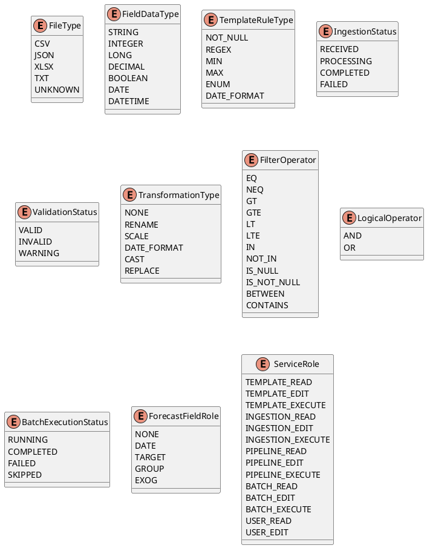

`ForecastFieldRole` substitui o que seria uma configuração de previsão separada e duplicada — cada `PipelineField` já declara o seu papel (ver §9.4). `ServiceRole` não tem um valor "ADMIN": um administrador é simplesmente um `User` (user-service) com todos os 14 valores atribuídos.

---

## 11. Tratamento de Erros

### GlobalExceptionHandler (core)

Aplica-se a todos os serviços via `@RestControllerAdvice`.

| Excepção | HTTP Status | Formato de Resposta |
|---|---|---|
| `ResourceNotFoundException` | 404 | `{"status": 404, "error": "Not Found", "message": "..."}` |
| `BadRequestException` | 400 | `{"status": 400, "error": "Bad Request", "message": "..."}` |
| `ServiceUnavailableException` | 503 | `{"status": 503, "error": "Service Unavailable", "message": "..."}` — lançada pelos métodos de fallback do Resilience4j (§14) |
| `MethodArgumentNotValidException` | 400 | `{"status": 400, "error": "Bad Request", "message": "validation.failed", "details": ["campo: mensagem"]}` |
| `Exception` genérica | 500 | `{"status": 500, "error": "Internal Server Error", "message": "..."}` — nunca expõe `ex.getMessage()`, só uma chave i18n genérica |

### Formato de Resposta de Erro
```json
{
  "status": 400,
  "error": "Bad Request",
  "message": "Mensagem de erro",
  "details": ["campo1: detalhe1", "campo2: detalhe2"]
}
```

### Internacionalização (I18n)

Todos os serviços (não só o `template-service`) usam `LocalValidatorFactoryBean.setValidationMessageSource(...)` (configurado em `I18nConfig`) para resolver chaves de mensagem — tanto em `@NotBlank(message = "{chave}")` como em `BadRequestException("chave", args)`/`ResourceNotFoundException("chave", args)` — via `messages.properties` (inglês, idioma por omissão) e `messages_pt.properties` (português), de acordo com o `Accept-Language` do pedido (`AcceptHeaderLocaleResolver`). Nenhuma anotação de validação ou excepção de negócio usa texto literal directamente — só chaves.

---

## 12. Diagramas UML

### 12.1 Diagrama de Classes — Visão Geral

```plantuml
@startuml class-overview
package "template-service" {
  class IngestionTemplate
  class TemplateField
  class TemplateValidationRule
  class IngestionTemplateService
  class IngestionTemplateController
  IngestionTemplate "1" *-- "0..*" TemplateField
  TemplateField "1" *-- "0..*" TemplateValidationRule
  IngestionTemplateController --> IngestionTemplateService
}

package "ingestion-service" {
  class IngestionJob
  class IngestedRecord
  class IngestionError
  class IngestionService
  class IngestionController
  class CsvIngestionProcessor
  IngestionJob "1" *-- "0..*" IngestedRecord
  IngestionJob "1" *-- "0..*" IngestionError
  IngestedRecord "1" *-- "0..*" IngestionError
  IngestionController --> IngestionService
  IngestionService --> CsvIngestionProcessor
}

package "pipeline-service" {
  class ForecastPipeline
  class PipelineField
  class PipelineFilter
  class PipelineService
  class PipelineController
  ForecastPipeline "1" *-- "0..*" PipelineField
  ForecastPipeline "1" *-- "0..*" PipelineFilter
  PipelineController --> PipelineService
}

package "batch-service" {
  class BatchScheduleConfig
  class BatchExecution
  class BatchScheduleService
  class BatchController
  class ForecastItemReader
  class ForecastItemProcessor
  class ForecastItemWriter
  class FilterEngine
  class TransformationEngine
  BatchScheduleConfig "1" *-- "0..*" BatchExecution
  BatchController --> BatchScheduleService
  ForecastItemProcessor --> FilterEngine
  ForecastItemProcessor --> TransformationEngine
}

package "gateway-service" {
  class SecurityConfig
  class FallbackController
}

package "user-service" {
  class Company
  class User
  class AuthController
  class JwksController
  class UserController
  class CompanyController
  class JwtTokenService
  Company "1" *-- "0..*" User
}

package "core" {
  class GlobalExceptionHandler
  class BadRequestException
  class ResourceNotFoundException
  class ServiceUnavailableException
  enum ServiceRole
  enum ForecastFieldRole
}
@enduml
```

### 12.2 Diagrama de Componentes

```plantuml
@startuml components
skinparam componentStyle rectangle

component [gateway-service\n:8080] as GW {
  [SecurityConfig]
  [FallbackController]
}

component [user-service\n:8086] as US {
  [AuthController]
  [JwksController]
  [UserController]
  [CompanyController]
}

component [template-service\n:8081] as TS {
  [IngestionTemplateController]
  [IngestionTemplateService]
}

component [ingestion-service\n:8082] as IS {
  [IngestionController]
  [IngestionService]
  [IngestionProcessorFactory]
  [CsvIngestionProcessor]
  [IngestionEventProducer]
  [IngestionEventConsumer]
}

component [pipeline-service\n:8083] as PS {
  [PipelineController]
  [PipelineService]
}

component [batch-service\n:8084] as BS {
  [BatchController]
  [BatchScheduleService]
  [BatchScheduler]
  [ForecastJob]
  [FilterEngine]
  [TransformationEngine]
}

component [prediction-service\n:8085 (Python)] as PRED {
  [forecast API]
  [ARIMA / ML forecasters]
}

database "userdb\n(H2)" as UDB
database "templatedb\n(H2)" as TDB
database "ingestiondb\n(H2)" as IDB
database "pipelinedb\n(H2)" as PDB
database "batchdb\n(H2)" as BDB
queue "Kafka\n(KRaft)" as KAFKA

US --> UDB
TS --> TDB
IS --> IDB
PS --> PDB
BS --> BDB
IS ..> KAFKA : produce/consume\nIngestionJobEvent

TS ..> US : JWKS
IS ..> US : JWKS
PS ..> US : JWKS
BS ..> US : JWKS
GW ..> US : JWKS

IS ..> GW : REST (proxy → TS)
PS ..> GW : REST (proxy → TS)
BS ..> IS : REST (directo)
BS ..> PS : REST (directo)
BS ..> PRED : REST POST
GW ..> TS : proxy
GW ..> IS : proxy
GW ..> PS : proxy
GW ..> BS : proxy
GW ..> PRED : proxy
@enduml
```

### 12.3 Diagrama de Estado — IngestionJob

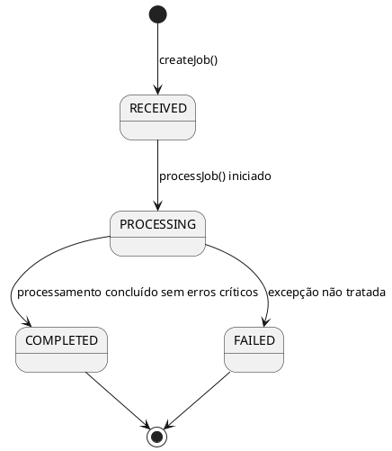

### 12.4 Diagrama de Estado — BatchExecution

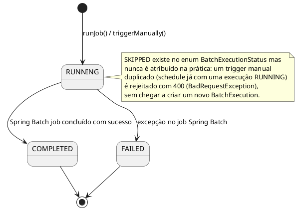

---

## Bases de Dados

| Serviço | JDBC URL (perfil `dev`) | Console H2 |
|---|---|---|
| template-service | `jdbc:h2:mem:templatedb` | `http://localhost:8081/h2-console` |
| ingestion-service | `jdbc:h2:mem:ingestiondb` | `http://localhost:8082/h2-console` |
| pipeline-service | `jdbc:h2:mem:pipelinedb` | `http://localhost:8083/h2-console` |
| batch-service | `jdbc:h2:mem:batchdb` | `http://localhost:8084/h2-console` |
| user-service | `jdbc:h2:mem:userdb` | `http://localhost:8086/h2-console` |

`gateway-service` não tem base de dados própria (é stateless — só valida e encaminha). Todas as bases de dados usam `ddl-auto=update`. O driver PostgreSQL já está incluído em todos os serviços, mas ainda não existe um perfil `prod` configurado (ver §15).

---

## Notas Técnicas Importantes

- **ObjectMapper**: `spring-boot-starter-webmvc` no Spring Boot 4 não auto-configura o `ObjectMapper`. Cada serviço declara um `@Bean` explícito em `JacksonConfig` com `JavaTimeModule` registado (datas como strings ISO-8601, não arrays).
- **Parsing CSV**: usa `String.split()` — não suporta campos entre aspas nem delimitadores escapados.
- **Resolução de campos CSV**: por `sourceName` contra o cabeçalho primeiro, depois `positionIndex` como fallback.
- **TransformationEngine**: falhas de transformação são silenciosas — o valor original é devolvido sem alteração.
- **BatchScheduler**: `lastRunAt` é persistido em `BatchScheduleConfig` (já não é um `Map` em memória) — sobrevive a reinícios do serviço. Ainda não existe replay automático de schedules perdidos durante downtime prolongado.
- **Upload de ficheiros**: limite de 20MB configurado em `spring.servlet.multipart.max-file-size`.
- **Ingestão assíncrona**: o `ingestion-service` processa a maior parte da ingestão de forma assíncrona via Kafka (`IngestionJobEvent`, com dead-letter-topic para falhas repetidas) — já não é puramente síncrona dentro do próprio pedido HTTP.
- **Segurança**: todos os serviços validam JWT (RS256) emitido pelo `user-service`; não há mais nenhum serviço "sem autenticação" em desenvolvimento local (ver §13).

---

## 13. Segurança e Multi-Tenancy

### 13.1 Emissão e validação de tokens

O `user-service` (porta 8086) é o único emissor de tokens: `POST /auth/login` valida credenciais (BCrypt) contra `UserRepository` e devolve um JWT assinado com RS256, incluindo as claims `roles` (lista de `ServiceRole`) e `companyId`. A chave pública é publicada em `GET /.well-known/jwks.json`; todos os outros serviços (incluindo o `gateway-service`) validam tokens contra este endpoint via `spring-boot-starter-oauth2-resource-server`, sem partilhar nenhum segredo.

### 13.2 Multi-tenancy

Cada entidade de topo (`IngestionTemplate`, `IngestionJob`, `ForecastPipeline`, `BatchScheduleConfig`) tem um campo `companyId`, lido a partir da claim `companyId` do JWT do pedido — nunca do corpo do pedido. As consultas de listagem e leitura são sempre filtradas por `companyId`; um `GET`/`PUT` por id devolve 404 (não 403) quando o recurso pertence a outra empresa, para não revelar sequer a sua existência.

### 13.3 Autorização por `ServiceRole`

Não existem papéis genéricos (ADMIN/USER) — `ServiceRole` (core) tem 14 valores, três por domínio (`READ`/`EDIT`/`EXECUTE`) mais dois para gestão de utilizadores (`USER_READ`/`USER_EDIT`). Um `User` (user-service) guarda um `Set<ServiceRole>`; um "administrador" é simplesmente um utilizador com todos os valores atribuídos. Cada serviço backend gate-keeps os seus próprios endpoints (ver tabela em §5) através do seu próprio `SecurityConfig` — o `gateway-service` só valida que o JWT é válido, não decide autorização por rota.

### 13.4 Chamadas entre serviços

- `ingestion-service`/`pipeline-service` → `template-service`: passam **através do gateway** (`services.template.url=http://gateway-service:8080` no perfil `docker`), reaproveitando a validação e o circuit breaker já existentes aí.
- `batch-service` → `pipeline-service`/`ingestion-service`: chamadas **diretas** (não passam pelo gateway), autenticadas com um token de serviço interno (`ServiceTokenProvider`, `core.serviceauth`) — não há utilizador humano por trás destas chamadas (são disparadas pelo `BatchScheduler`).

---

## 14. Resiliência e Observabilidade

### 14.1 Resilience4j

`@Retry` + `@CircuitBreaker` (Spring AOP, `spring-boot-starter-aspectj`) nas chamadas inter-serviços listadas em §6. Configuração por instância (`application.properties`): 3 tentativas, backoff exponencial a partir de 500ms (multiplicador 2), janela do circuit breaker de 10 chamadas, limiar de falha 50%, `waitDurationInOpenState=15s`. `ResourceNotFoundException` é explicitamente excluída de ambos — um 404 é um resultado de negócio válido, nunca uma falha transitória (excepto no `IngestionClient` do batch-service, cujas chamadas nunca devolvem 404 legitimamente). Quando as tentativas se esgotam por falha genuína, o método de fallback lança `ServiceUnavailableException` → HTTP 503.

### 14.2 Actuator

`spring-boot-starter-actuator` nos 5 serviços backend (não no gateway, que já tinha o seu próprio conjunto de endpoints de gestão do Spring Cloud Gateway) — `/actuator/health`, `/actuator/info`, `/actuator/metrics`, e `/actuator/health` com `show-details=always`. Onde há Resilience4j, também `/actuator/circuitbreakers` e `management.health.circuitbreakers.enabled=true`.

### 14.3 Correlation ID

`CorrelationIdFilter` + `CorrelationIdAutoConfiguration` (`core`) propagam um identificador de correlação em todos os pedidos HTTP, incluindo entre serviços (via `CorrelationIdRestClientInterceptor`), visível nos logs (`[cid:...]`) para seguir um pedido de ponta a ponta através de vários serviços.

---

## 15. Perfis Spring e Containerização

### 15.1 Perfis

Cada um dos 5 serviços backend com base de dados tem dois perfis:
- **`dev`** (`application-dev.properties`) — datasource H2, `ddl-auto=update`, consola H2. Activado automaticamente (`spring.profiles.default=dev`) sempre que nenhum perfil é definido explicitamente.
- **`docker`** (`application-docker.properties`) — só existe onde há URLs inter-serviços a redefinir (todos excepto `user-service`, cuja única referência é a si próprio); aponta para nomes de serviço do Docker Compose em vez de `localhost`.

Os dois perfis coexistem (`SPRING_PROFILES_ACTIVE=dev,docker`) porque tratam de propriedades disjuntas — um perfil `prod` (Postgres) ainda não foi criado.

### 15.2 Docker

`docker-compose.yml` (raiz) orquestra: Kafka (`apache/kafka`, modo KRaft, sem ZooKeeper, com dois listeners — um para containers, outro para o host), os 6 serviços Java, e o `prediction-service` (Python). Cada serviço tem o seu **próprio `Dockerfile`** independente (não um único ficheiro partilhado com múltiplos estágios) — construir a imagem de um serviço nunca lê o código-fonte de outro. Cada `Dockerfile` Java faz dois builds Maven separados:
```dockerfile
RUN ./mvnw -f core/pom.xml clean install -DskipTests
RUN ./mvnw -f <service>/pom.xml clean package -DskipTests
```
em vez de `-pl <service> -am` a partir da raiz — esta última forma obrigaria o Maven a validar a lista `<modules>` completa do `pom.xml` da raiz, o que falharia por faltarem as pastas dos restantes serviços no contexto de build de cada `Dockerfile`. Isto só funciona porque `core/pom.xml` tem `<relativePath/>` vazio no `<parent>` (o seu pai é `spring-boot-starter-parent`, resolvido do repositório, nunca do `pom.xml` da raiz) — ou seja, o `core` é verdadeiramente autónomo.
